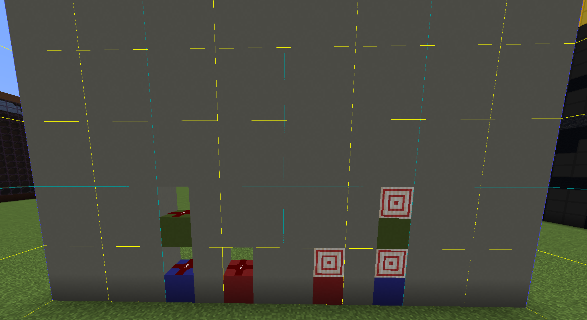

# Standards

**This file contains all the standards for components required to get it accepted into the datapack.**

# Port Format
All ports will be named in this format:

`[DIR][TYPE]-[#PORTS][ROLE]`

### How the format works:

- **[DIR]** > Can be either an Input, Output, or Bidirectional port (Labelled I, O or B) Bidirectional port holes don't exist yet.
- **[TYPE]** > BIN (Binary) / HEX (Hexadecimal)
- **[#PORTS]** > The number of ports it has, as a number. If it only has 1 port, you don't have to include this tag! _(e.g. Just BIN instead of BIN-1)_
- **[ROLE]** > Most ports will be SD (Standard), but ports with specific roles will have different colors and have a different named tag. For example, HEX-STATE. If the port is SD you don't have to include this tag! _(e.g. just HEX instead of HEX-SD)_

# Port Types

- Each port would have a corresponding colored concrete block under it. 
- Locations of the port holes are in (X, Y), in which (1, 1) is the bottom left block on a 16x16 face looking from the side of a chunk. _(Clarification: Port HOLES, not the concrete position)_

### BIN
- **Color:** 🟥 Red Concrete
- **Location:** IBIN at (7, 2) – OBIN at (9, 2) 
- The default port. Used to connect redblocks together, and is the most simplest (as it does not preserve signal strength)

### HEX
- **Color:** 🟦 Light Blue Concrete
- **Location:** IHEX at (5, 2) – OHEX at (11, 2)
- A more advanced port. They preserve the signal strength from the output of the previous block. Useful for HEX calculations.
- Reccomended to have IHEX this next to an IBIN to ensure compatibility with other redblocks (IBIN would set the input on that side to 15 or 0 to convert it to HEX)

### HEX-STATE
- **Color:** 🟩 Green Concrete
- **Location:** IHEX-STATE at (5, 4) – OHEX-STATE at (11, 4)
- Not in use (yet), but will be used to check the state of a redblock which is currently doing an operation.

